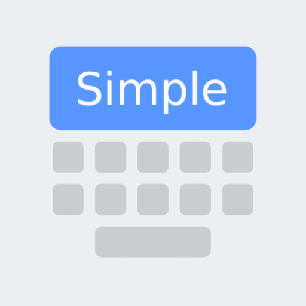
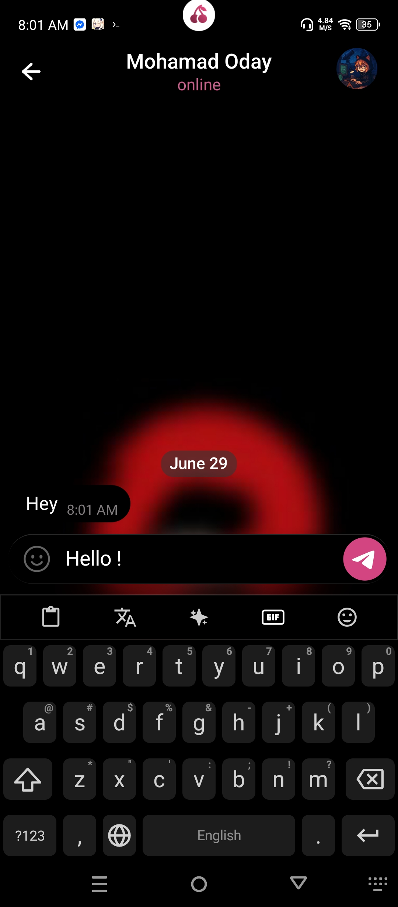
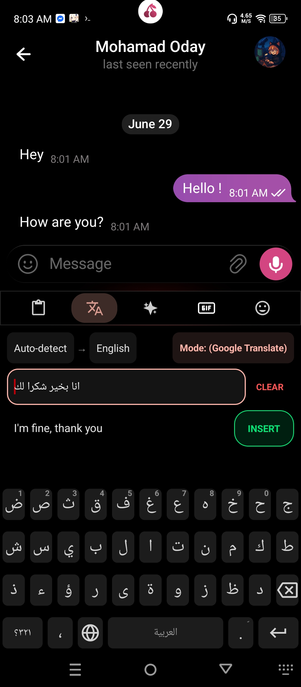
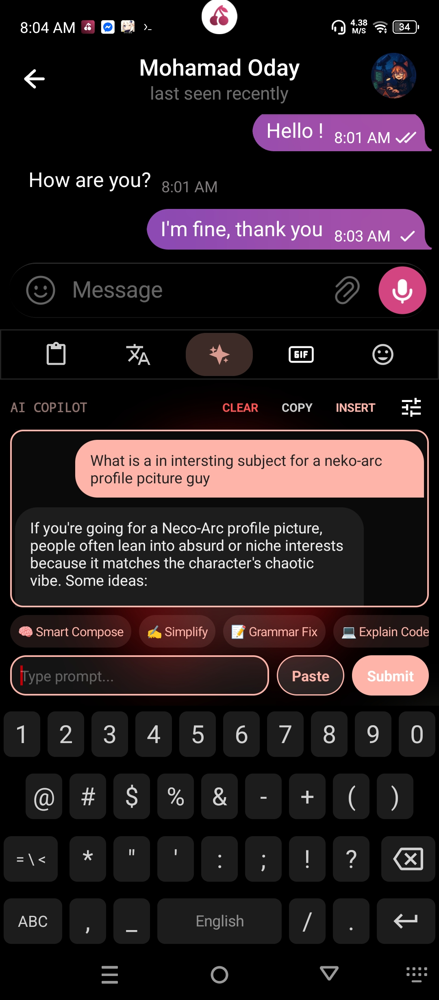
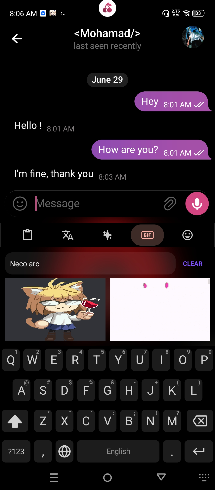
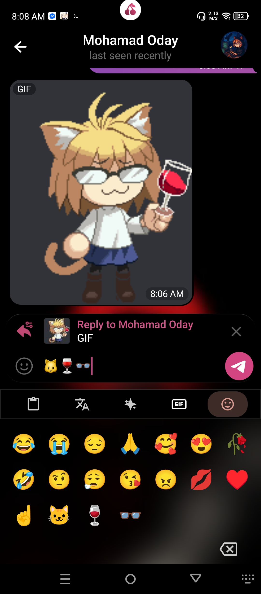
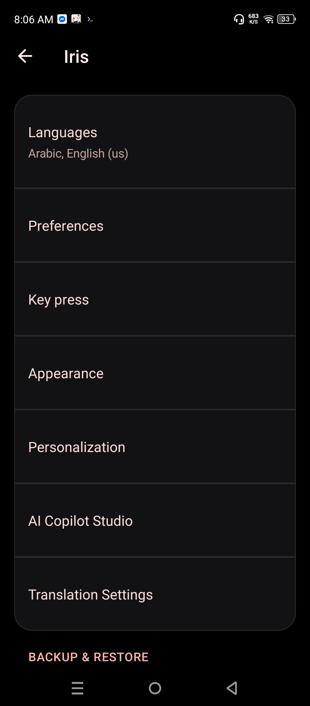

<div align="center">
  
  <h1>Iris Keyboard</h1>
  <p>A fast, private, and highly customizable Android keyboard based on AOSP / Simple Keyboard.</p>

  <p>
    <a href="https://github.com/MohamadOday/Iris/releases"></a>
    <a href="https://f-droid.org/packages/nabu.iris.keyboard/"></a>
    <a href="LICENSE"></a>
    <a href="https://github.com/MohamadOday/Iris/releases"></a>
    <a href="app/build.gradle"></a>
  </p>
</div>

---

## Overview

Iris keeps the lightweight, low-latency foundation of [Simple Keyboard](https://github.com/rkkr/simple-keyboard) while integrating modern features: Material You dynamic coloring, a clipboard manager, offline and online translation, an optional AI assistant bar, physical mechanical sound packs, and extensive UI personalization.

Iris is completely tracker-free and does not collect personal analytics. Network permissions are strictly optional and only triggered when using online translation, AI endpoints, GIF search, or the soundpack downloader.

---

## Screenshots

<div align="center">
  <table>
    <tr>
      <td align="center" width="33%">
        
      </td>
      <td align="center" width="33%">
        
      </td>
      <td align="center" width="33%">
        
      </td>
    </tr>
    <tr>
      <td align="center" width="33%">
        
      </td>
      <td align="center" width="33%">
        
      </td>
      <td align="center" width="33%">
        
      </td>
    </tr>
  </table>
</div>

---

## Key Features

- **Material You Dynamic Theming**: Automatically synchronizes keyboard and accent colors with your Android wallpaper (Monet palette on Android 12+, wallpaper extraction on Android 8.1–11, and adaptive palettes on older versions). Includes an AMOLED True Black toggle and manual RGB color picker.
- **Clipboard History**: Built-in clipboard manager with pinning, instant suggestion bar, search, and batch clearing.
- **Translation Engine**:
  - *Offline:* On-device neural machine translation via Google ML Kit (`MlKit` build).
  - *Online / AI:* Quick web and AI-assisted translation for over 50 languages.
- **AI Copilot Toolbar**: Optional keyboard assistant capable of grammar correction, tone adjustment, smart compose, and custom prompts via:
  - Local **Ollama** instances (on-device or LAN)
  - **Google Gemini** API
  - Custom **OpenAI-compatible** endpoints (e.g. OpenRouter, DeepSeek, LocalAI)
- **Mechanical Sound Engine**: Built-in audio synthesizer and downloadable Mechvibes soundpacks (Cherry MX Blue, Brown, Red, Black, Holy Pandas, NK Creams, IBM Model M, Topre, etc.) with custom ZIP import and live scraper.
- **Layout & Typographic Control**: 55+ keyboard layouts (QWERTY, Dvorak, Colemak, QWERTZ, AZERTY, Arabic, Cyrillic, etc.), 90+ locales, custom key shapes, key size scaling, spacing, height adjustments, and bottom navigation offsets.
- **GIF & Media Search**: Integrated Tenor, GIPHY, and Klipy GIF browser with custom emoji shortcut management.
- **Backup & Restore**: Export and import full keyboard settings and dictionary backups via JSON.

---

## Downloads

APKs are available on [GitHub Releases](https://github.com/MohamadOday/Iris/releases) and [F-Droid](https://f-droid.org/packages/nabu.iris.keyboard/).

| Variant | Description | Recommended For |
| :--- | :--- | :--- |
| **`MlKit`** | Includes Google ML Kit translation libraries. | Users who want fully offline, on-device translation model downloads. |
| **`NoMlKit`** | Lightweight, 100% open-source build without Google proprietary binaries. | F-Droid users and privacy-focused setups. (Online & AI translation still supported). |

---

## Building from Source

### Prerequisites
- JDK 17
- Android SDK (API Level 36 / Build-Tools 36.0.0)

### Commands

Clone the repository:
```bash
git clone https://github.com/MohamadOday/Iris.git
cd Iris
```

Build debug APKs:
```bash
./gradlew assembleNomlkitDebug  # FOSS variant
./gradlew assembleMlkitDebug    # ML Kit variant
```

Build release APKs:
```bash
./gradlew assembleRelease
```

Generated APKs will be located in `app/build/outputs/apk/`.

---

## Privacy & Network Disclosure

Iris is designed with a privacy-first approach:
- **No telemetry, trackers, or background data collection.**
- **Typing data never leaves your device.**
- Network calls are strictly made only when the user explicitly triggers an external feature (e.g. requesting a GIF, running an AI prompt, or translating text via an online API).
- All AI and custom API keys are stored securely in local device shared preferences.

---

## Contributing & Support

Contributions, bug reports, and layout improvements are welcome.
- For bug reports or feature requests, open an issue on the [GitHub Issue Tracker](https://github.com/MohamadOday/Iris/issues).
- For discussion and questions, join the Telegram channel: [@bn3di](https://t.me/bn3di).

---

## License

Iris Keyboard is released under the [Apache License 2.0](LICENSE).
Based on [Simple Keyboard](https://github.com/rkkr/simple-keyboard) by Raimondas Rimkus and the Android Open Source Project (AOSP).
Third-party notices and licenses are documented in [NOTICE](NOTICE).
